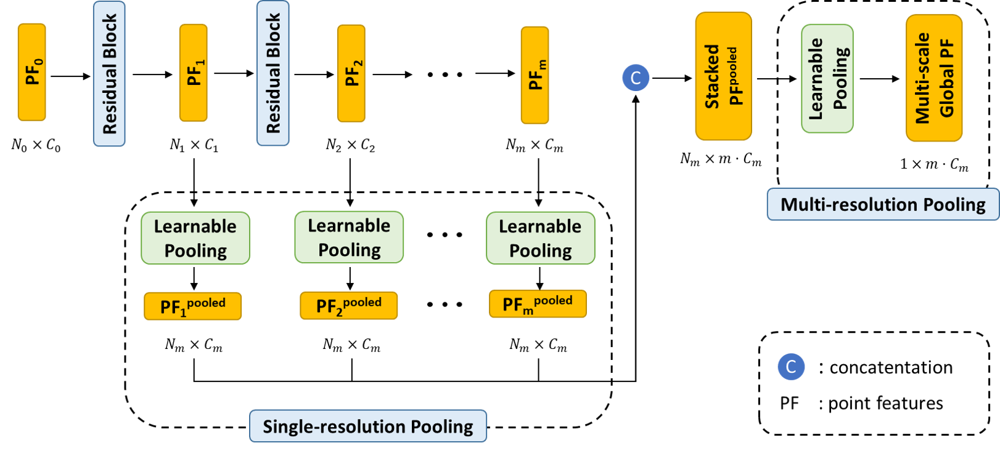

# PointStack

This repository provides the official PyTorch implementation for the following paper:

**Advanced Feature Learning on Point Clouds using Multi-resolution Features and Learnable Pooling** 
Kevin Tirta Wijaya, Dong-Hee Paek, and [Seung-Hyun Kong](http://ave.kaist.ac.kr/) 
[\[**arXiv**\]](https://arxiv.org/abs/2205.09962)
> **Abstract:** *Existing point cloud feature learning networks often incorporate sequences of sampling, neighborhood grouping, neighborhood-wise feature learning, and feature aggregation to learn high-semantic point features that represent the global context of a point cloud.
Unfortunately, such a process may result in a substantial loss of granular information due to the sampling operation.
Moreover, the widely-used max-pooling feature aggregation may exacerbate the loss since it completely neglects information from non-maximum point features.
Due to the compounded loss of information concerning granularity and non-maximum point features, the resulting high-semantic point features from existing networks could be insufficient to represent the local context of a point cloud, which in turn may hinder the network in distinguishing fine shapes.
To cope with this problem, we propose a novel point cloud feature learning network, PointStack, using multi-resolution feature learning and learnable pooling (LP).
The multi-resolution feature learning is realized by aggregating point features of various resolutions in the multiple layers, so that the final point features contain both high-semantic and high-resolution information.
On the other hand, the LP is used as a generalized pooling function that calculates the weighted sum of multi-resolution point features through the attention mechanism with learnable queries, in order to extract all possible information from all available point features.
Consequently, PointStack is capable of extracting high-semantic point features with minimal loss of information concerning granularity and non-maximum point features.
Therefore, the final aggregated point features can effectively represent both global and local contexts of a point cloud.
In addition, both the global structure and the local shape details of a point cloud can be well comprehended by the network head, which enables PointStack to advance the state-of-the-art of feature learning on point clouds.
Specifically, PointStack outperforms various existing feature learning networks for shape classification and part segmentation on the ScanObjectNN and ShapeNetPart datasets.*

We will make the codes and pre-trained models public in the near future.
